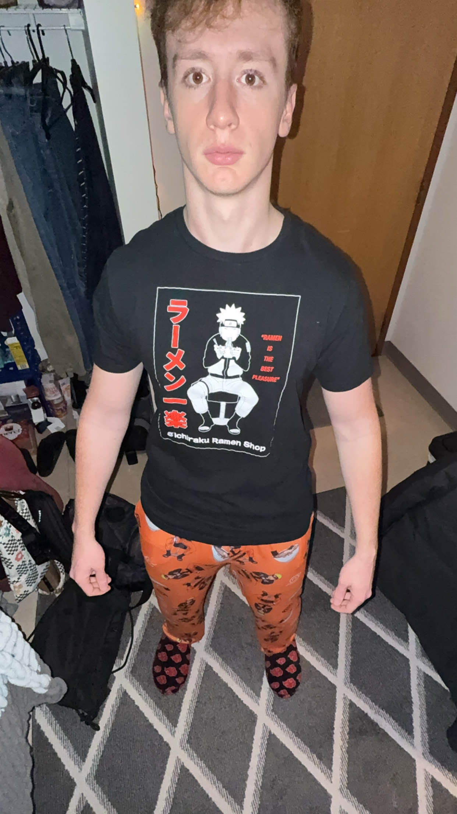
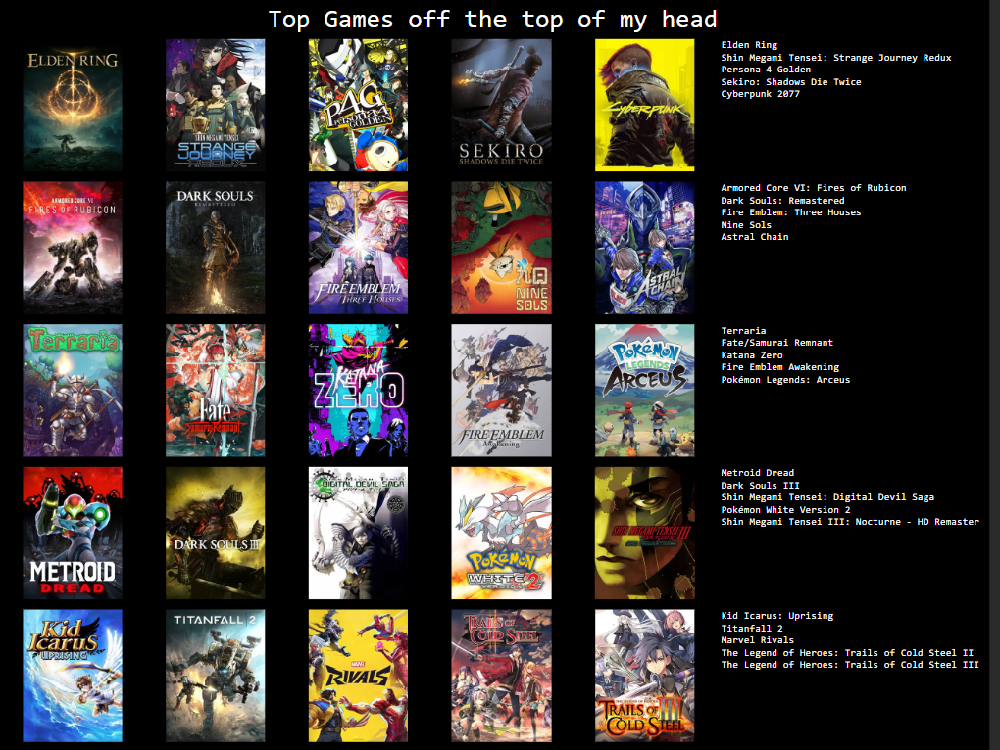

# About Me

It is I, the creator of this site. 

I am Alex. Web design is my passion.

The only information I am willing to share here is what my top twenty-five favorite games are. If that's okay with you, then keep reading. Otherwise, go back to <a href="/" >the home page</a> or something idc. 

I used [Topsters 3](https://topsters.org) to make this list, and it had 25 spots to fill. 

For a gamer like me, that isn't **that many** of spots to fill. The __idea__ is that each row isn't ordered, but to *make* it into the row, the game has to be in that tier.

> So, a game in the same row isn't necessarily better than the other games in the row, but it is better than the games in rows below it.
>> (this is me seeing what a blockquote looks like)

Anyway, here's the list:

